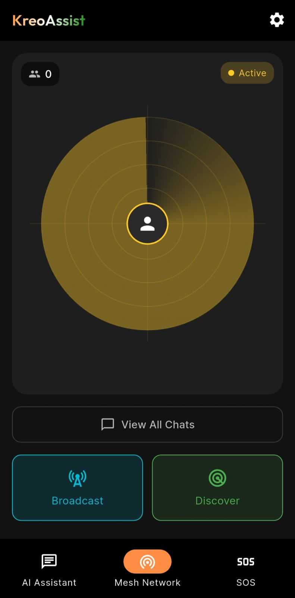
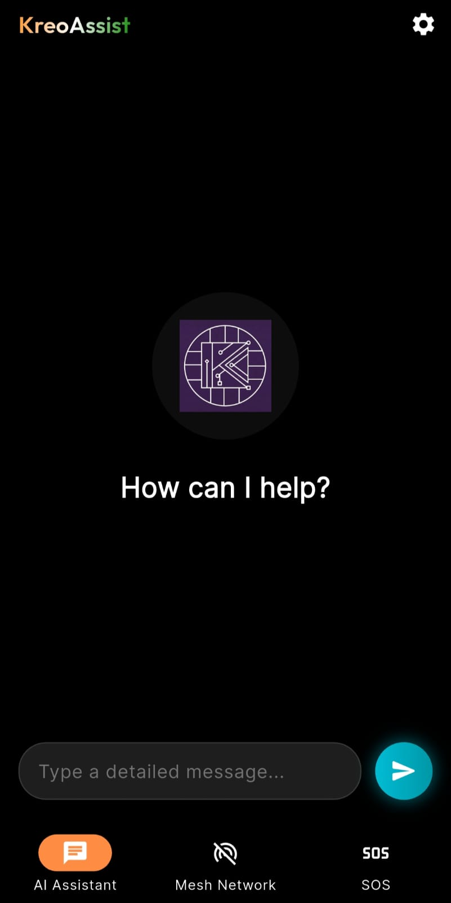
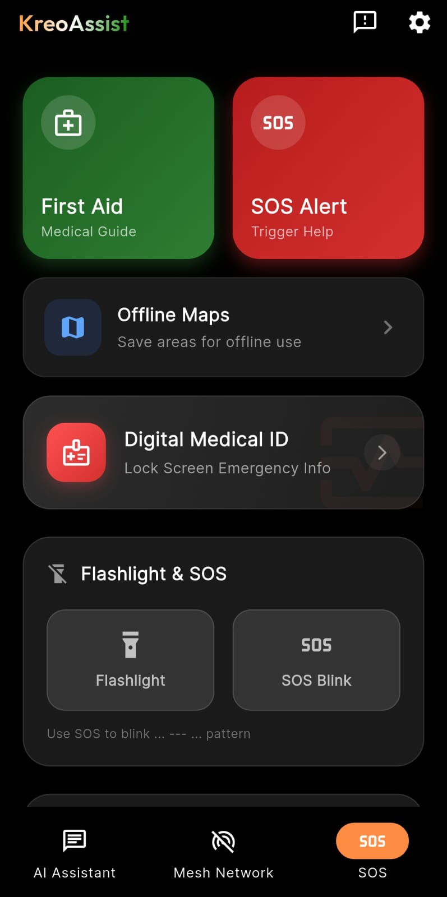
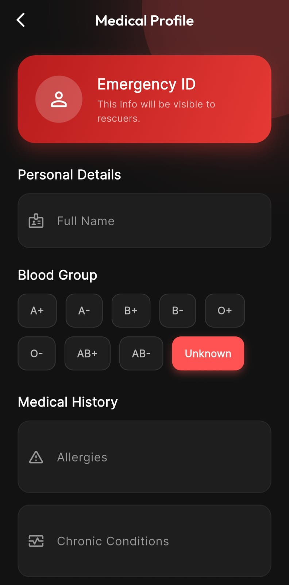
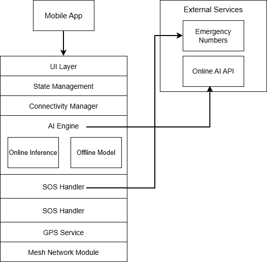
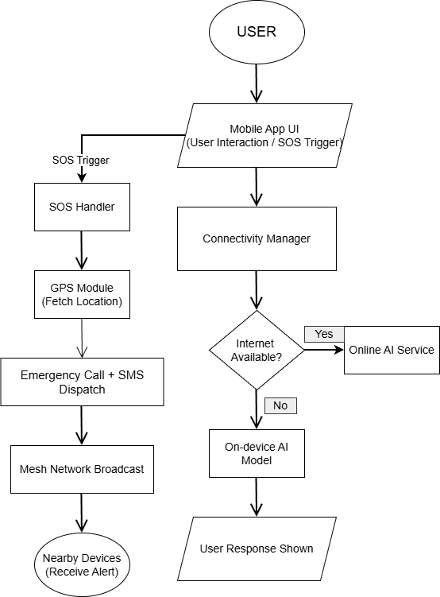
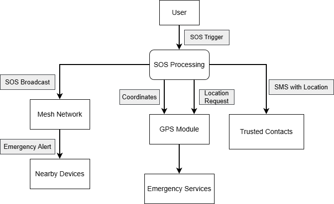

# KreoAssist
**Offline-First Disaster Management & Emergency Assistance System**

---

🌐 **Live Website:** [https://kreoassist-web.netlify.app/](https://kreoassist-web.netlify.app/)

## 📌 Overview
KreoAssist is an **offline-first disaster management and emergency assistance application** designed for scenarios where conventional communication infrastructure becomes unreliable or completely unavailable.

The system focuses on resilience, decentralization, and rapid response by combining:
*   **Device-to-device mesh communication**
*   **Hybrid online + offline AI assistance**
*   **Direct emergency signaling and medical access**

The current implementation represents a functional prototype, built to validate critical emergency workflows under real-world disaster constraints.

---

## 🧪 Prototype Status
KreoAssist is implemented as a working prototype with emphasis on:
*   **Offline reliability**
*   **Correctness under stress conditions**
*   **Graceful degradation during failures**

### Implemented Capabilities
*   **Offline-first application:** Fully usable during network outages.
*   **Hybrid AI Emergency Assistant:**
    *   Online AI remains usable without offline model.
    *   Optional offline AI model download.
*   **One-Tap SOS System:**
    *   Emergency calling to national services (112, 100, 101, 102).
    *   Automatic SMS alerts with live GPS location.
*   **Mesh Network Communication:**
    *   Bluetooth & Wi-Fi Direct based communication.
    *   Background scanning even when the app is minimized.
    *   
*   **First-Aid Guide:** Fully accessible without internet.
*   **Rescue Signaling Tools:** Flashlight, SOS Morse-code.
*   **Offline Maps Support:** Download specific geographic regions.

---

## 🎯 Problem Statement
During disasters such as floods, earthquakes, or mass accidents:
1.  **Mobile networks fail** or become congested.
2.  **Emergency instructions are unavailable**.
3.  **Centralized systems become single points of failure**.

**KreoAssist addresses these challenges through:**
*   Decentralized local communication.
*   Offline intelligence and guidance.
*   Rapid peer-to-peer coordination.

---

## 🌟 Core Features

### 📡 Offline Mesh Communication
*   Works without internet or cellular networks.
*   Uses Bluetooth and Wi-Fi Direct.
*   Broadcasts emergency states (NEED HELP, I’M SAFE).

### 🧠 Hybrid AI Emergency Assistant
*   Automatically switches between Online inference and On-device AI models.
*   Provides guidance for CPR, Burns, Fractures, Choking.
*   

### 🆘 Emergency SOS Dashboard
*   One-tap SOS triggers calls to 112 and SMS alerts.
*   Quick-dial buttons for Police (100), Fire (101), Ambulance (102).
*   

### 🏥 Offline First-Aid & Medical ID
*   Step-by-step emergency instructions.
*   **Digital Medical Emergency ID:** Stores Blood group, Allergies, Chronic conditions.
*   

---

## 🧩 System Architecture

*High-level architecture showing the interaction between UI, Logic, and Local Services.*

### System Flow

*Flow of data from User Interaction to Mesh Network and AI Engine.*

### SOS Data Flow

*Data flow diagram for the Emergency SOS system.*

---

## 🛠️ Technology Stack
*   **Framework:** React Native / Expo (Prototype logic ported to React for web).
*   **State Management:** Context API & Custom Hooks.
*   **Connectivity:** Simulated Bluetooth/Wi-Fi Direct logic.
*   **AI Engine:** Hybrid inference mock-up.

---

## 👥 Team & Contributions (Kreodev)

| Member | Role | Responsibility |
| :--- | :--- | :--- |
| **Bhavesh (`workbhaveshpandey-create`)** | **Logic Lead** | Core Application Loop & Hooks (`src/hooks`) |
| **Gaurav (`SGarryy`)** | **Backend** | Storage & API Services (`src/services`) |
| **Aastha (`gehuaastha2008-ux`)** | **UI/UX** | Design System & Styling (`src/components/ui`) |
| **Kalpana (`kalpana1957`)** | **Features** | Core Sections (`src/components/sections`) |

---

©️ 2025 Kreodev. All rights reserved.
