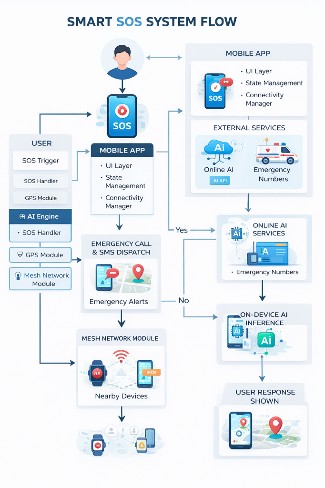
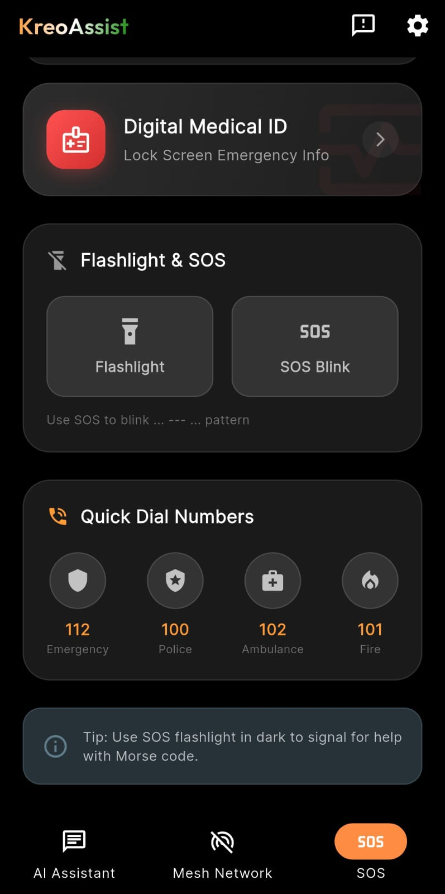
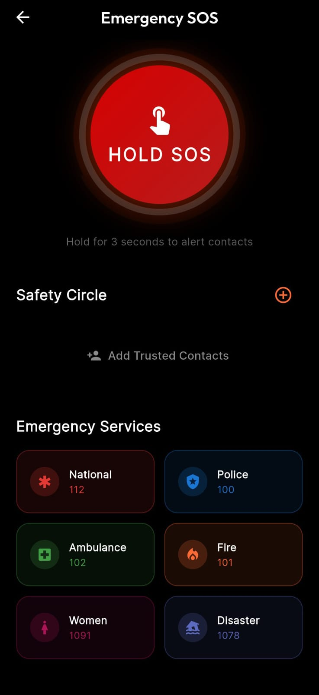
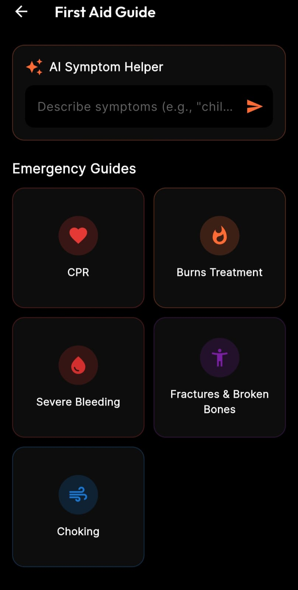
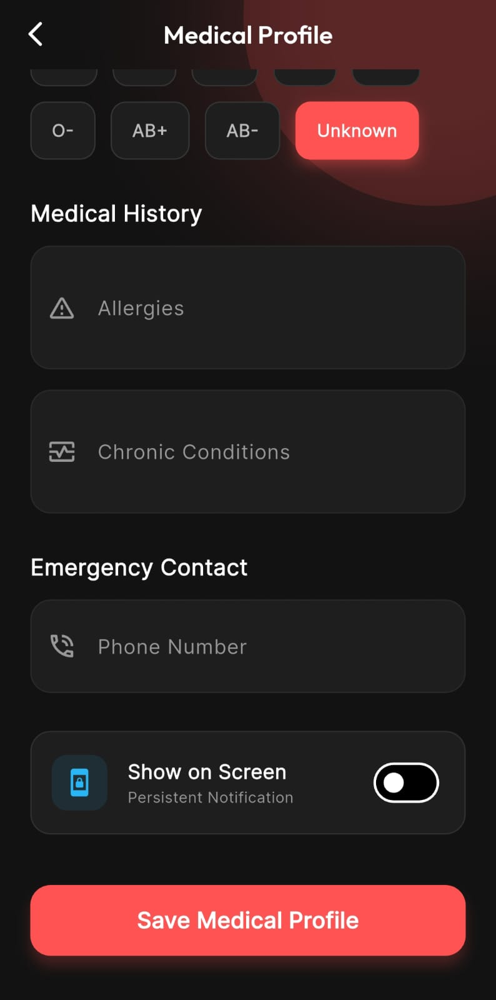

# 🚨 KreoAssist
### Offline-First Disaster Management & Emergency Assistance Prototype

**🌐 Live Demo:** [https://kreoassist-web.netlify.app/](https://kreoassist-web.netlify.app/)

---

## 📌 Overview

KreoAssist is an offline-first disaster management and emergency assistance application designed for scenarios where conventional communication infrastructure becomes unreliable or unavailable.

The application focuses on *resilience, decentralization, and rapid response* by combining device-to-device mesh communication, hybrid AI-based assistance, and direct emergency actions.
The current implementation serves as a *functional prototype*, validating critical emergency workflows under real-world constraints rather than aiming for full production deployment.

## 🧪 Prototype Status

KreoAssist is implemented as a working prototype with emphasis on *reliability, offline operation, and correctness* during emergency conditions.

### Implemented Prototype Capabilities

*   Offline-first application with full usability during network disruptions.
*   Hybrid AI assistant with optional offline model download:
    *   Users can skip downloading the offline AI model during initial setup.
    *   Offline AI can be downloaded later from settings as required.
    *   Online AI remains functional without offline model download.
*   One-tap SOS system with:
    *   Emergency calling to national services (112, 100, 101, 102).
    *   Automatic SMS alerts with GPS location to trusted contacts.
*   Mesh network communication supporting:
    *   Background scanning even when the app is minimized.
    *   Local broadcast of emergency alerts to nearby devices.
*   Safety circle and trusted contacts management.
*   Interactive first-aid guide accessible fully offline.
*   Flashlight and SOS Morse-code blinking mode for low-visibility rescue signaling.
*   Digital Medical Emergency ID:
    *   Stores blood group, allergies, and chronic conditions.
    *   Can be displayed persistently on screen for rescuers during unconscious states.
    *   Can be shared with trusted contacts.
*   Offline maps support:
    *   Users can download specific geographic areas.
    *   Maps remain usable without internet connectivity.
*   In-app feedback and bug reporting system.
*   Built-in app versioning and update notification system:
    *   Users can check for updates directly within the app.

System scalability, extended integrations, and governance-level deployment considerations are *intentionally planned for the next round*.

---

## 🎯 Problem Statement (Governance Context)

During disasters such as floods, earthquakes, fires, and large-scale accidents:

*   Mobile networks may fail or become congested
*   Emergency instructions are delayed or inaccessible
*   Verified first-aid guidance is unavailable at critical moments
*   Centralized systems become single points of failure

KreoAssist addresses these challenges by enabling *decentralized communication, offline intelligence, and rapid local coordination*, aligning with governance-driven disaster response and public safety objectives.

---

## 🌟 Core Features

### 📡 Offline Mesh Communication
*   Enables communication without internet using Bluetooth and Wi-Fi Direct
*   No dependency on central servers
*   Broadcast emergency states such as:
    *   NEED HELP
    *   I’M SAFE
    *   Custom alerts
*   Designed to remain operational in network blackout zones

---

### 🧠 Hybrid AI Emergency Assistant (Online + Offline)
*   Automatically selects between online inference and on-device models
*   Provides first-aid and emergency guidance (CPR, burns, fractures, choking)
*   Supports offline processing for privacy and reliability
*   Ensures assistance remains available during complete connectivity loss

---

### 🆘 Emergency SOS Dashboard
*   One-tap SOS triggers:
    *   Emergency calls to national services (112)
    *   SMS alerts containing precise GPS coordinates to trusted contacts
*   Dedicated direct-dial buttons:
    *   Police (100)
    *   Fire (101)
    *   Ambulance (102)
*   Quick safety-status broadcasts for rapid coordination

  
  
  

---

### 🏥 Offline First-Aid Guide & Digital Medical ID
*   Step-by-step instructions for common emergency scenarios.
*   Categorized access for rapid navigation.
*   Fully functional without internet connectivity.
*   AI-assisted follow-up questions when available.
*   Integrated *Digital Medical ID* feature:
    *   Stores critical medical information such as blood group, allergies, and chronic conditions.
    *   Can be displayed on the lock screen or persistently for rescuers during emergencies.
    *   Allows sharing of medical information with trusted contacts for faster response.

  
  
  

## 🎨 Design Considerations

*   AMOLED-optimized dark theme for reduced battery usage
*   Minimal, stress-aware UI design for emergency situations
*   Optimized animations for modern mobile devices
*   Focus on usability under panic and low-visibility conditions

---

## 🔁 System Flow & Data Flow Diagrams

This section documents the *technical flow charts and data flow diagrams* describing how KreoAssist operates during emergency scenarios.

### 1️⃣ System Flow Chart (High-Level Application Flow)

This flow chart represents the end-to-end execution path of the application under both online and offline conditions.

Flow description:
*   User interacts with the application UI
*   Connectivity manager determines network availability
*   AI requests are routed to:
    *   Online inference service (if available), or
    *   On-device AI model (offline mode)
*   SOS actions trigger GPS retrieval, emergency calls, and alerts
*   Emergency packets are broadcast to nearby devices via mesh networking
*   Mesh nodes propagate safety status locally

---

### 2️⃣ SOS Data Flow Diagram (DFD)

This DFD illustrates how emergency data moves through the system after an SOS is initiated.

Data flow:
*   User initiates SOS
*   GPS module provides location coordinates
*   SOS handler performs:
    *   Emergency call execution
    *   SMS delivery to trusted contacts
*   SOS message payload is broadcast over the mesh network
*   Nearby devices receive and display emergency status updates

---

### 3️⃣ Local Data Model (On-Device Storage Schema)

Since KreoAssist is designed as an offline-first system, it primarily relies on *local on-device storage* instead of a centralized database.

The following data entities are stored and managed locally:

*   *User Profile*
    *   Basic user preferences
    *   Language and accessibility settings
*   *Trusted Contacts*
    *   Name
    *   Phone number
    *   Relationship type
*   *Medical Emergency ID*
    *   Blood group
    *   Allergies
    *   Chronic conditions
    *   Emergency notes
*   *Offline First-Aid Content*
    *   Categorized first-aid instructions
    *   Cached media and reference data
*   *Offline Maps Data*
    *   Downloaded map regions
    *   Cached route and location metadata
*   *System State & Cache*
    *   Mesh network session metadata
    *   SOS status flags
    *   Cached AI responses (when applicable)

All sensitive data is stored *locally on the device by default* and is shared only through explicit user actions (SOS triggers or manual sharing), ensuring privacy and governance-aligned data handling.

---

## 🧩 System Architecture & Technical Flow

KreoAssist follows a modular architecture designed to support both online and offline execution paths.

*   User actions originate from the interface layer
*   Connectivity manager controls online/offline routing
*   AI engine processes queries based on connectivity
*   SOS handler manages emergency signaling
*   Mesh controller distributes messages to nearby devices

---

## 🛠️ Technology Stack

*   Framework: Flutter (Dart) / React (Web Dashboard)
*   State Management: Context API & Custom Hooks
*   Connectivity: Simulated Bluetooth and Wi-Fi Direct
*   Location Services: Browser Geolocation API
*   Emergency Handling: Call & SMS Mock Protocols
*   Offline Intelligence: On-device inference
*   Online Intelligence: External inference service

---

# 🚀 Round 2 — Scaled System & Full Solution Plan

This section extends the Round-1 prototype to describe *system scaling, reliability, and governance-ready deployment*, as required for Round-2 evaluation.

---

## 🧩 Scaled System Architecture (High-Level)

---

## 📈 Scalability & Failure Handling Strategy

*   Offline-first guarantees remain primary.
*   Mesh network supports multi-hop message propagation.
*   SOS messages are prioritized over non-critical traffic.
*   Message TTL prevents congestion in dense disaster zones.
*   Optional cloud components are *non-blocking* and used only for:
    *   Verified alerts
    *   Update distribution
    *   Analytics (when available)
*   Graceful degradation strategies are defined for GPS unavailability, partial mesh connectivity, and low-battery scenarios.

---

## 🔐 Governance & Compliance Readiness

*   Supports integration with verified government alert systems.
*   Uses standardized emergency data formats.
*   Privacy-first handling of medical and location data.
*   Works without dependency on centralized servers.
*   Sensitive user data remains local by default and is shared only through explicit emergency actions.

---

## 🔗 Project Links (Round 2)

*   **Website:** [https://kreoassist-web.netlify.app/](https://kreoassist-web.netlify.app/)
*   **APK Download:** *(Coming Soon)*
*   **Demo Video:** *(Coming Soon)*

---

## ✅ Submission & Contribution Compliance

*   Functional codebase is included (not README-only).
*   DFDs and system diagrams are present.
*   Git workflow followed using branches and PRs.
*   AI tools used only for assistance, not autonomous agents.
*   Each contributor has visible code commits.

---

## 👥 Team & Contribution Breakdown

This project is developed collaboratively by a four-member hackathon team under *Kreodev*, with each member owning and contributing code to specific functional areas of the system.

*   **Member 1 (Bhavesh):** Core Application & SOS Systems
    *   Responsible for implementing the core application logic, SOS workflows, emergency triggering mechanisms, GPS-based alert handling, and overall system integration across modules.

*   **Member 2 (Aastha):** UI / UX & Accessibility Layer
    *   Developed the user interface components, screen flows, onboarding experience, accessibility considerations, visual consistency, and interaction logic across SOS, First Aid, Settings, and Medical ID screens.

*   **Member 3 (Gaurav):** Mesh Networking & Offline Communication
    *   Implemented mesh networking logic, background device discovery, peer-to-peer communication workflows, offline message propagation, and local broadcast handling for emergency alerts.

*   **Member 4 (Kalpana):** System Architecture & Supporting Modules
    *   Worked on system design, scalable architecture planning, flow diagrams (DFDs, system architecture, data flows), offline map integration logic, and supporting application modules alongside documentation and research-driven implementation inputs.

All team members have contributed *code-level changes* to their respective modules, with commits visible in the repository history and changes merged using pull request workflows as per Git best practices.

---

## 📄 Notes

This repository represents a hackathon prototype focused on validating emergency workflows under real-world constraints.
The project prioritizes resilience, offline operation, and governance-aligned disaster response.

> **Versioning & Development Note**
> The current repository represents a *stable prototype build* used for *Round-1 evaluation*.
> The application was iterated internally across multiple versions during development.
> For official submission, the project has been consolidated into a clean, collaborative repository with structured commits and a single public deployment.
>
> **Round-2** extends this work with *scaled system planning, architectural design, and growth strategies* while preserving the existing functional prototype.

---

©️ 2025 Kreodev. All rights reserved.
