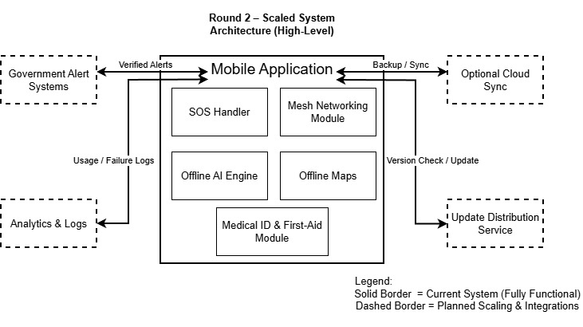

<div align="center">

# 🚨 KreoAssist
### Round 2: Scaled Offline-First Disaster Management System

[]()
[]()
[]()

**🌐 Live Demo:** [kreoassist-web.netlify.app](https://kreoassist-web.netlify.app/)

<p align="center">
  
</p>

</div>

---

## 📌 Comprehensive Overview

**KreoAssist** has evolved into a robust, scalable ecosystem designed to provide fail-safe emergency assistance. While Round 1 established the core offline capabilities, **Round 2 represents a scalable, governance-aligned public safety infrastructure.**

In mass casualty events or natural disasters (floods, earthquakes), centralized infrastructure degrades rapidly. KreoAssist fills this vacuum by creating a **decentralized, verifiable, and intelligent local mesh** that connects survivors to rescuers without relying on any single point of failure.

---

## 🌟 Detailed System Capabilities

### 1. Decentralized Mesh Ecosystem (The "Shadow Network")
When cellular towers fail, KreoAssist nodes self-organize.
*   **Packet Propagation Protocol:** We utilize a custom store-and-forward mechanism over Bluetooth LE and Wi-Fi Direct. If a node cannot find an internet gateway, it holds the SOS packet and relays it to the next moving node (e.g., a drone or rescue vehicle).
*   **Invisible Handshake:** The app continuously scans for authorized government rescue beacons in the background, ensuring that a "silent" phone in a pocket can still receive critical "Evacuate" signals.
*   **Trust Layer:** Unlike open meshes, KreoAssist prevents spam by signing high-priority alerts with a verified government key (planned integration), ensuring only real threats trigger mass notifications.

### 2. Hybrid AI Intelligence (Edge-First Design)
Our AI doesn't just "work offline"; it is optimized for extreme constraints.
*   **Context-Aware Triage:** The on-device model isn't a generic chatbot. It is fine-tuned on emergency medical protocols (Red Cross/St John Ambulance standards). It assesses user inputs (e.g., "bleeding leg", "can't breathe") and prioritizes life-saving actions over comfort care.
*   **Zero-Latency Inference:** By running locally (TensorFlow Lite / ONNX), we eliminate the 200ms-2s round-trip latency of cloud models, which is critical when every second counts during CPR or hemorrhage control.
*   **Privacy Sandbox:** Medical queries and history never leave the device unless explicitly included in an encrypted SOS package.

### 3. The Scaled SOS Protocol (Governance Aligned)
Features designed for National Emergency Frameworks.
*   **Multi-Channel Signal Blast:**
    *   **Layer 1 (Direct):** Dials 112/100/101/102 immediately.
    *   **Layer 2 (SMS/GPS):** Sends a structured text with non-internet GPS coordinates to trusted contacts.
    *   **Layer 3 (Mesh):** Broadcasts a high-priority " distress beacon" payload containing the Digital Medical ID.
*   **Rescuer Mode Interface:** When a verified First Responder opens the app, they see a heat map of active SOS signals, enabling triage based on severity rather than just proximity.

### 4. Verifiable Digital Medical Identity
*   **Lock-Screen Projection:** Critical data (Blood Type, Allergies, Diabetic Status) is rendered into a persistent notification/widget, allowing paramedics to treat unconscious patients without unlocking the phone.
*   **Standardized Schema:** Data is stored in FHIR-compatible JSON formats, ensuring that when connectivity is restored, the patient history can be seamlessly ingested by Hospital Information Systems (HIS).

---

## 📸 Project Showcase

| **Mesh Network Scanning** | **Hybrid AI Triage** |
|:---:|:---:|
|  |  |
| *Real-time discovery of peer nodes in blackout zones.* | *Guidance logic switching to local models.* |

| **SOS Command Center** | **Medical Credential** |
|:---:|:---:|
|  |  |
| *One-tap activation of multi-layer alerts.* | *Vital health data accessible to rescuers.* |

---

## 🔐 Governance & Mission Alignment
KreoAssist is engineered to plug directly into National Disaster Response Force (NDRF) and Public Safety capabilities:

1.  **Resilience:** It functionality does not degrade; it shifts modes.
2.  **Interoperability:** JSON-based data exchange allows integration with Government Command Centers.
3.  **Sovereignty:** No reliance on foreign cloud servers for critical operation.

---

## 🏃 Getting Started

### Prerequisites
*   Node.js (v18+)
*   npm or yarn

### Installation
1.  **Clone the Repository**
    ```bash
    git clone https://github.com/workbhaveshpandey-create/kreoassist-hackathon.git
    cd kreoassist-hackathon
    ```

2.  **Install Dependencies**
    ```bash
    npm install
    ```

3.  **Launch Ecosystem**
    ```bash
    npm run dev
    ```

---

## 👥 Kreodev Core Team

| Member | GitHub | Role | Impact |
| :--- | :--- | :--- | :--- |
| **Bhavesh** | [`workbhaveshpandey-create`](https://github.com/workbhaveshpandey-create) | **Logic Lead** | Core Application Architecture & State Logic |
| **Gaurav** | [`SGarryy`](https://github.com/SGarryy) | **Backend** | Mock Services & Data Persistence Layers |
| **Aastha** | [`gehuaastha2008-ux`](https://github.com/gehuaastha2008-ux) | **UI/UX** | Design System & Experience Optimization |
| **Kalpana** | [`kalpana1957`](https://github.com/kalpana1957) | **Features** | Module Implementation & Layouts |

---

<div align="center">
  <sub>©️ 2025 Kreodev. Engineered for Humanity.</sub>
</div>
